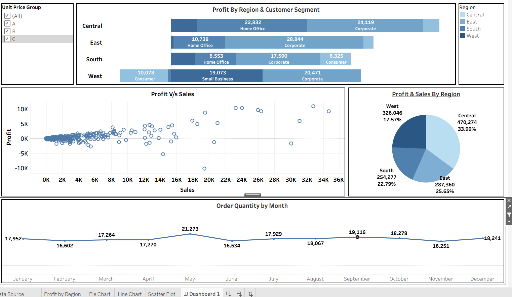

# Superstore Sales Data Analytics Using


## Project Overview
This project analyzes Superstore sales data using Tableau, focusing on over 8,500 sales records. The goal is to uncover insights and trends to support business decisions. The analysis includes data cleaning (ETL/ELT), visualization, and dashboard creation.

## Tools Used

| Tool            | Logo                                                                 | Purpose                                    |
|-----------------|----------------------------------------------------------------------|--------------------------------------------|
| Tableau         |  | Data visualization and dashboard creation  |
| Python          |  | Data cleaning, ETL/ELT processes           |
| Microsoft Excel | 📊 | Initial data storage and cleaning          |
| MySQL           |  | Data management and transformation         |

## Data Cleaning
- **ETL (Extract, Transform, Load)** and **ELT (Extract, Load, Transform)** methods were used to clean and prepare the sales data for analysis.

## Dashboard Preview



---

- **Sales Profit by Region :** Visualizes sales distribution by region with amount 


---
- **Pie Chart:** Visualizes sales distribution by region


---
- **Line Chart:** Shows sales trends over months


---

- **Scatter Plot:** Highlights relationships between sales and other variables


---

## Dashboard Video Preview
<video width="600" controls>
	<source src="Images/Super Store .mp4" type="video/mp4">
	Your browser does not support the video tag.
</video>

## Folder Structure
```
Superstore Sales Data Analytics/
├── ~Super Store Sales__17964.twbr
├── Dash Board 1.twbx
├── Super Store Sales.twbx
├── Data/
│   ├── Sample+-+Superstore+Sales poject.xls
│   └── Sample+-+Superstore+Sales+(Excel).xls
├── Images/
│   ├── Dashboard.png
│   ├── Pie Chart.png
│   ├── Region Sales.png
│   ├── Sale by Month.png
│   ├── Scatter Plot.png
│   └── Super Store .mp4
```

## How to Use
1. Open Tableau and load the `.twbx` files for interactive dashboards.
2. Review the Excel files in the `Data` folder for raw and cleaned data.
3. Explore the `Images` folder for exported charts and dashboard visuals.

## Author
Santosh Gorebal

---
*This project demonstrates practical data analytics and visualization skills using Tableau and Excel.*
